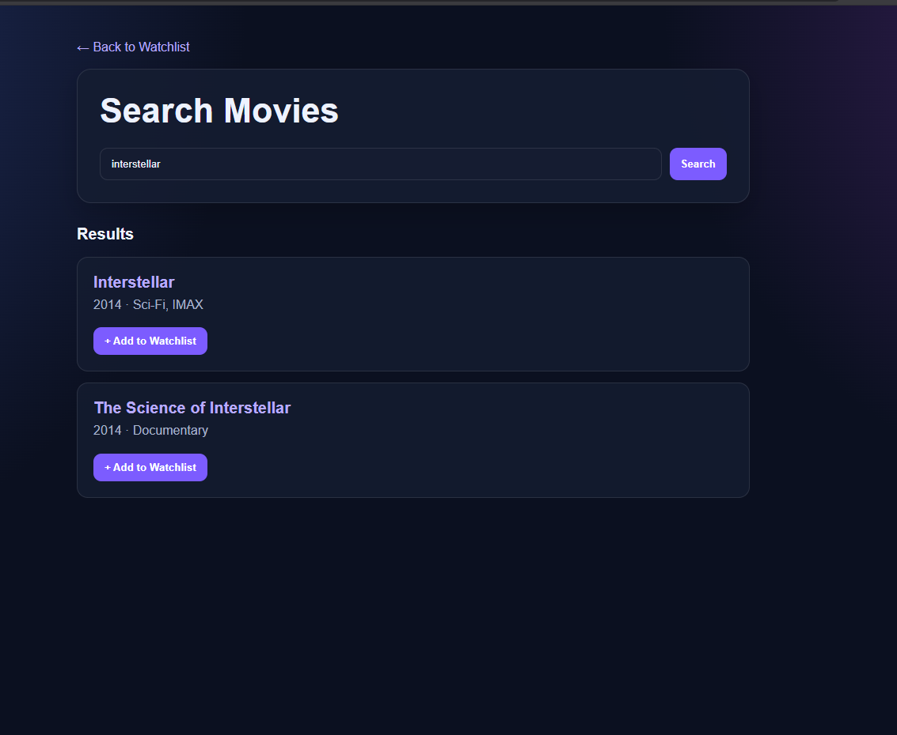
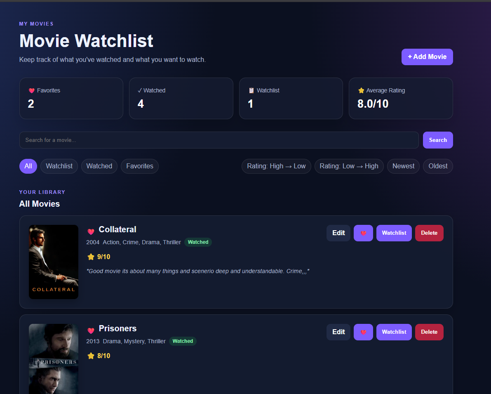
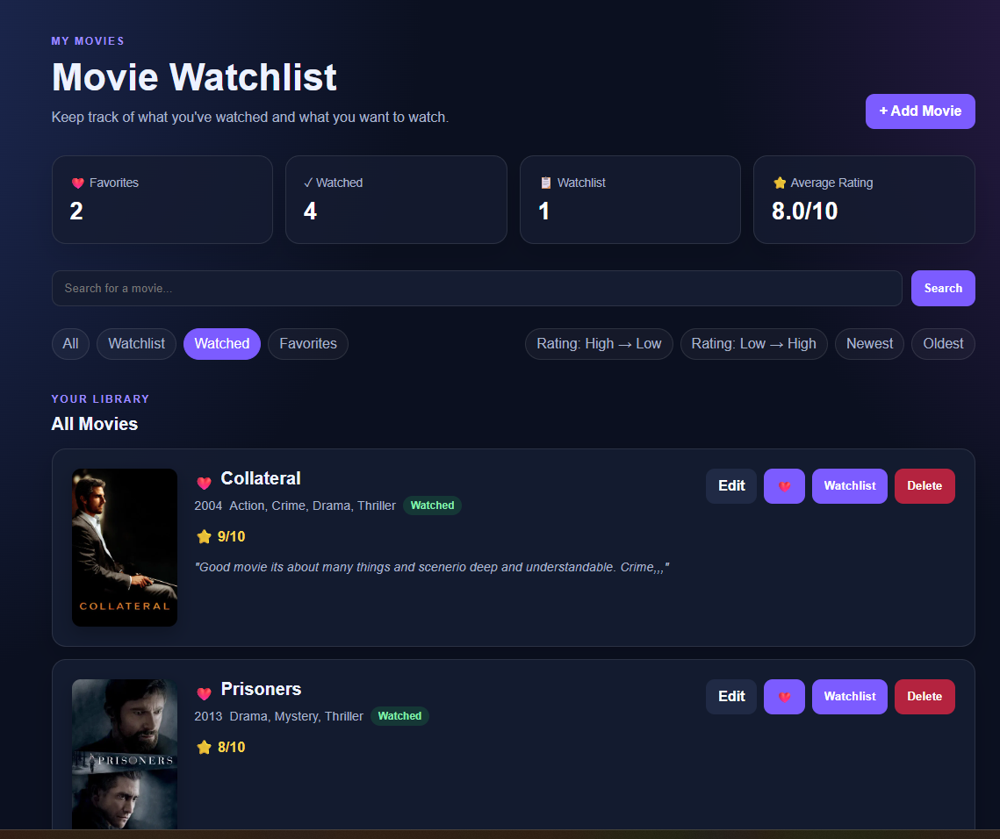

# 🎬 Movie Watchlist

A personal movie tracking web application for organizing movies, keeping track of what you've watched, and managing your personal watchlist.

The application combines a local movie library with the TMDB API to provide movie information, posters, cast, directors, and overviews.

---

## ✨ Features

### 🎞️ Movie Management

- Search for movies from a movie catalog
- View detailed movie information
- Add movies to your watchlist
- Add movies directly as watched
- Mark movies as watched or move them back to the watchlist
- Delete movies from your library

### ❤️ Favorites

- Add movies to your favorites
- Remove movies from favorites
- Favorite movies are automatically marked as watched
- Favorites are prioritized on the main library

### ⭐ Ratings & Notes

- Rate movies from **1 to 10**
- Add personal notes
- Edit ratings and notes at any time
- View your average movie rating

### 🔎 Search & Discovery

- Search movies by title
- View movie details before adding them
- Browse movie information from TMDB
- View movie posters
- View overview, runtime, director, and cast
- Search for movie trailers on YouTube

### 📊 Library & Organization

- Watchlist count
- Watched movie count
- Favorite movie count
- Average rating
- Filter by:
  - All
  - Watchlist
  - Watched
  - Favorites
- Sort by:
  - Rating: High → Low
  - Rating: Low → High
  - Newest
  - Oldest

### 📱 Responsive Design

The application is designed to work on both desktop and mobile screens.

---

## 🛠️ Technologies

| Technology | Purpose |
|------------|---------|
| Python | Application logic |
| Flask | Web framework |
| SQLite | Local database |
| CS50 SQL Library | Database interaction |
| HTML | Page structure |
| CSS | Styling and responsive design |
| JavaScript | Client-side interactions |
| TMDB API | Movie information and posters |

---

## 📁 Project Structure

```text
Movie-Watchlist/
│
├── app.py
├── movies.db
├── README.md
├── .gitignore
│
├── templates/
│   ├── index.html
│   ├── search.html
│   ├── movie.html
│   ├── catalog_movie.html
│   ├── add.html
│   └── edit.html
│
└── static/
    ├── style.css
    └── script.js
```

---

## ⚙️ Setup

### 1. Clone the repository

```bash
git clone <repository-url>
cd Movie-Watchlist
```

### 2. Install dependencies

```bash
pip install flask cs50 python-dotenv
```

### 3. Configure TMDB

Create a `.env` file in the project root:

```text
TMDB_ACCESS_TOKEN=your_token_here
```

The `.env` file should **never be committed to the repository**.

### 4. Run the application

```bash
flask run
```

Then open the local address provided by Flask in your browser.

---

## 🔐 Environment Variables

The application uses an environment variable for the TMDB API access token:

```text
TMDB_ACCESS_TOKEN
```

Sensitive environment variables are kept outside the repository using `.env` and `.gitignore`.

---

## 🎬 TMDB

This product uses the TMDB API but is not endorsed or certified by TMDB.

---

## 🚀 Future Development

This project is currently in **v1.0 Beta**.

Planned improvements may include:

- Progressive Web App (PWA) support
- Improved mobile experience
- More advanced movie discovery
- Genre and advanced filtering
- Detailed viewing statistics
- User accounts
- Cloud database support
- Social features
- Movie recommendations

---
## 📸 Screenshots
### Home, Movie Details, Search







## 📌 Version

**v1.0 Beta**
